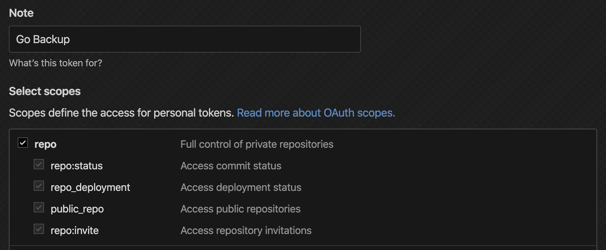
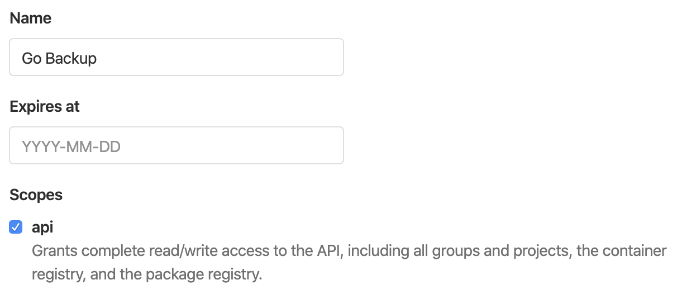

# gobackup

[](https://goreportcard.com/report/github.com/tempor1s/gobackup)

A tool that allows you to backup all your GitHub, GitLab repos onto your local machine, and even upload them to a different repo manager!

### Table of Contents

1. [Installation]("#installation")
2. [Usage]("#usage")
3. [Milestones]("#milestones")

## Installation

A quick guide on how to install the tool. Not currently available.

```bash
brew tap tempor1s/gobackup
brew install gobackup
```

## Usage

Before you get started, you are going to need either a GitHub personal access token, or a GitLab personal access token.
For example, if you want to clone your GitHub public repos and upload them to GitLab, you are going to need a GitLab personal access token.
if you want to clone ALL your repos on GitHub and upload them to gitlab, you are going to need a personal access token for both of them.

- GitHub Personal Access Token
You can create a GitHub token [here.](https://github.com/settings/tokens/new)



- GitLab Personal Access Token
You can create a GitLab token [here.](https://gitlab.com/profile/personal_access_tokens)



```bash
# clone all the repos to your local machine. --token is optional, but you need it to clone private repositories - token is not required
gobackup download <platform> <username> --token=123abc

# once you have your repos cloned to your local machine, you can either upload them to GitHub or GitLab - in this case a token is required
gobackup upload <platform> <directory> --token=123abc
```

Thats it! All your repos should now be backed to your chosen platform, and you can delete the local copy if you want to :)

## Milestones

- [x] Clone a single repository to your computer through CLI.
- [x] Clone multiple repositories to local computer
- [x] Clone multiple reposiories using concurrency
- [x] Add support for cloning GitLab repos
- [x] Upload cloned repositories to GitLab 
- [x] Do the above concurrently
- [x] Do the reverse, upload cloned repositories to GitHub
- [x] Do the above concurrently
- [ ] Add backup command that will download the repo to memory (or disk I guess) and then instant upload it to new platform of choice
- [ ] Respect the privacy status of a cloned repo when we upload it again
- [ ] Set up Cron Job to periodically backup new repos / changes to old repos to local / other service like GitLab
